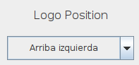

# Examples-Centered-JAVA

# Centrar combobox

~~~java

	DefaultListCellRenderer listRenderer = new DefaultListCellRenderer();
	
	listRenderer.setHorizontalAlignment(DefaultListCellRenderer.CENTER);
	
	combobox.setRenderer(listRenderer);
	
~~~

# Centrar frame

~~~java

	frame.setLocationRelativeTo(null);

~~~
